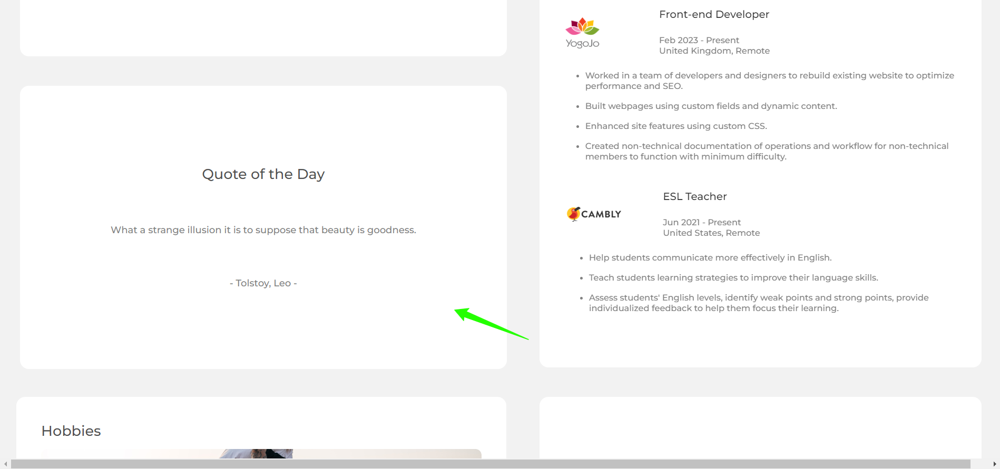

<!-- Please update valmy-gallery-dev-ioue in the {}  -->

<h1 align="center">Portfolio Page</h1>

<div align="center">
   Solution for a challenge from  <a href="http://devchallenges.io" target="_blank">Devchallenges.io</a>.
</div>

<div align="center">
  <h3>
    <a href="https://chris-chamberlain-portfolio.netlify.app/">
      Site
    </a>
    <span> | </span>
    <a href="https://devchallenges.io/challenges/5ZnOYsSXM24JWnCsNFlt">
      Challenge
    </a>
  </h3>
</div>

<!-- TABLE OF CONTENTS -->

## Table of Contents

- [Overview](#overview)
- [Built With](#built-with)
- [Features](#features)
- [Contact](#contact)

<!-- OVERVIEW -->

## Overview
I developed this portfolio page as a submission to a [DevChallenges](https://devchallenges.io/challenges) challenge. The [challenge](https://devchallenges.io/challenges/hhmesazsqgKXrTkYkt0U) was to build an application to complete the given user stories and replicate the provided Figma design. I then customised it to fit my own needs.


### Built With

<!-- This section should list any major frameworks that you built your project using. Here are a few examples.-->

- HTML
- SCSS
- JavaScript
- JQuery
- API Ninja


## Features

## Fully Responsive UI


## Quote of the day feature via integration of API Ninja's quote API 


## scroll animations implemented with JavaScript's Intersection Observer API


## Custom built filter for projects


## Automatic testimonial slider implemented with JQuery's Owl Carousel


- Go to live [site](https://chris-chamberlain-portfolio.netlify.app/)

## How To Use

To clone and run this application, you'll need [Git](https://git-scm.com) and [Node.js](https://nodejs.org/en/download/) (which comes with [npm](http://npmjs.com)) installed on your computer. From your command line:

```bash
# Clone this repository
$ git clone https://github.com/AkaraTawng/my-gallery-dev-io.git

# Install dependencies
$ npm install

# Run the app
$ npm start
```
## Contact

- [Website](https://christopher-chamberlain.netlify.app/)
- [GitHub](https://github.com/AkaraTawng)
- [Twitter](https://twitter.com/chris_tawan)
- [LinkedIn](https://www.linkedin.com/in/christopher-chamberlain-023507205/)

